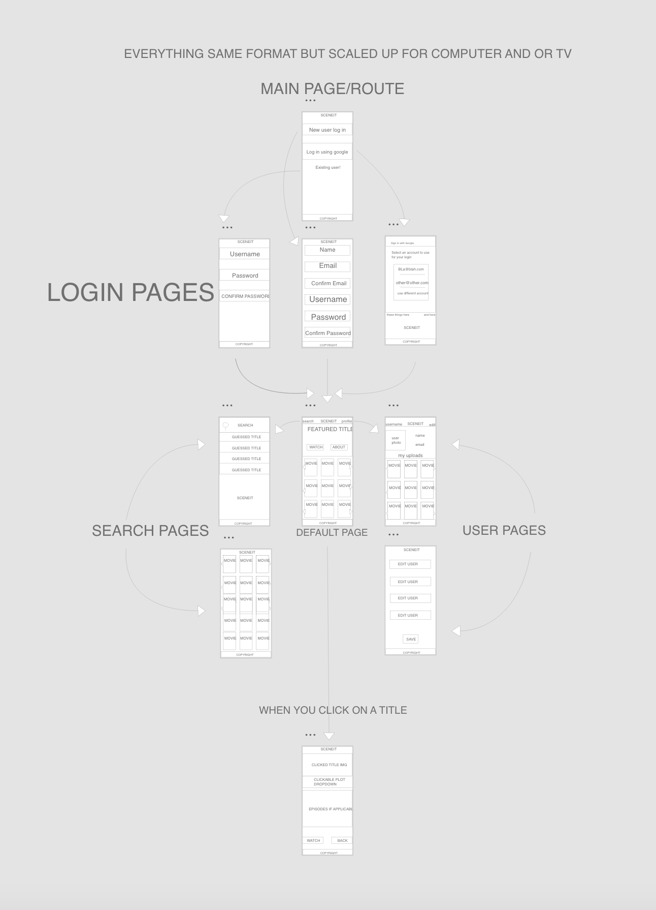

# <Scene/ it>

##### (Blake Marter, Jacob Deleon, Kai Richardson, Kaleb Merriman)

## Overview

`<Scene/ it>™` is a video streaming service that will connect users to many video services as a one stop shop of video enjoyment. 

Jacob -
“I LOVE internet videos and HATE having multiple tabs/windows open on my browser. I want one place to find all my videos, and to save the ones that I want to view again. “

Jacob is a typical internet user that wants an enjoyable experience viewing all of his videos without being interrupted by switching between different sites.

We at <Scene/ it>™ will provide this experience for him and anyone like him. 

## Layout

Developing in React with a "Mobile First" mindset. We are using 12 componants. 

* Header
* Splash
* Login
* New User
* Google Oauth2
* Main
* Search bar
* Search results
* User info
* User edit
* Video Player
* Footer

## Responsibilities

`Kaleb` and `Blake` will be taking on the `front-end`.

`Kai` and `Jacob` will be taking on the `back-end`.

Although we all want to learn more about each end so we will all be helping with both front-end and back-end aspects of our app.

## Deliverables

#### Deliverable #1: 

1. `Kaleb` will be creating the wire-frame with input from everyone.

2. `Jacob` will provide a screenshot of the project management board and also create the original GitHub repo.

3. Our entire group will be working together to complete other elements due for the first deliverable.

## Technologies used

* MongoDB
* Express
* React
* Node.js
* Axios
* Mongoose
* ES6
* CSS

## Website

https://sceneitapp.herokuapp.com/

## Copyright

Blake, Jacob, Kai, Kaleb © 2019.  All rights reserved.
